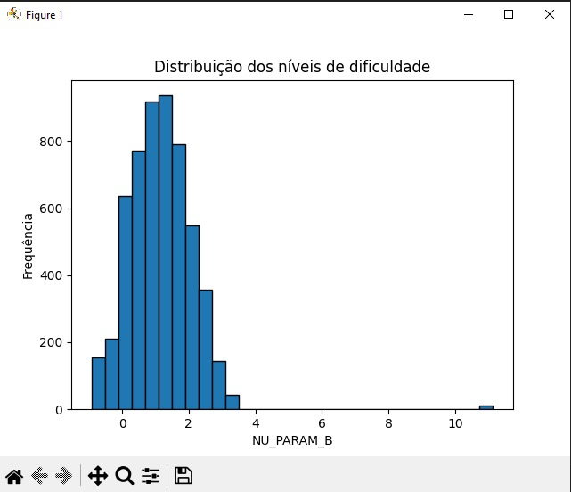
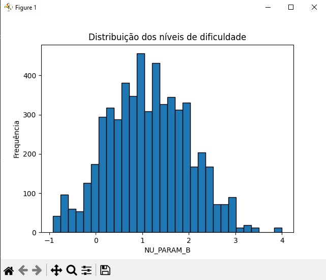
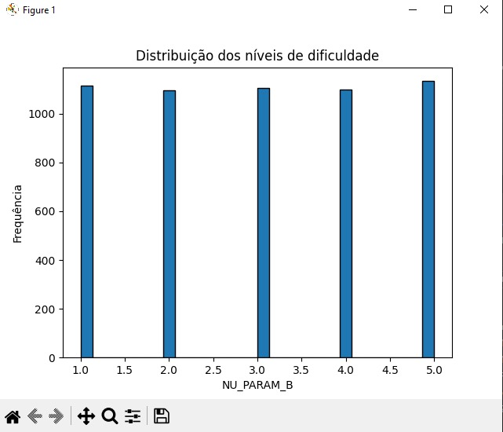

# Fluxo de Tratamento e Análise dos Dados do ENEM

Esses scripts foram desenvolvidos para disponibilizar os dados limpos em CSV e documentados em Markdown, facilitando a consulta e integração com o banco de dados do projeto.

## Etapas do Processo

1. **Extração das questões dos PDFs**
   - As questões são extraídas dos arquivos PDF e organizadas em um CSV (`enem2024_dia1_azul.csv`).

2. **Limpeza e análise do campo `NU_PARAM_B` (nível de dificuldade)**
   - **Análise exploratória:**  
     - Estatísticas descritivas e histograma da distribuição original de `NU_PARAM_B` são gerados para entender a dispersão e identificar outliers.
     - 
   - **Tratamento de outliers:**  
     - Valores acima de 4 são limitados a 4 para evitar distorções.
     - 
   - **Categorização:**  
     - O campo `NU_PARAM_B` é dividido em 5 níveis de dificuldade com base nos percentis calculados.
     - O resultado é salvo em `ITENS_PROVA_PROCESSADOS.csv`.
   - **Visualização pós-categorização:**  
     - Um novo histograma mostra a distribuição dos níveis categorizados (valores de 1 a 5).
     - 

3. **Merge com questões e alternativas**
  - Os dados processados são cruzados com o arquivo de questões (`enem2024_dia1_azul.csv`), utilizando `CO_PROVA`, `CO_POSICAO` e `TP_LINGUA` como chave composta.
  - O resultado inicial é salvo em `ITENS_PROVA_FINAL.csv`, com a coluna de dificuldade `NU_PARAM_B`, `CO_HABILIDADE` e `SG_AREA`.
  - Em seguida, o `ITENS_PROVA_FINAL.csv` pode ser enriquecido com um terceiro CSV (`habilidades_map.csv`, separador `;`). Esse arquivo contém `SG_AREA;COMPETENCIA;CO_HABILIDADE;DS_HABILIDADE` e é mesclado por `SG_AREA` + `CO_HABILIDADE` para adicionar `COMPETENCIA` e `DS_HABILIDADE` ao arquivo final (`ITENS_PROVA_FINAL_COM_AREA.csv`).

## Justificativa do Tratamento

- Os gráficos gerados antes e depois do tratamento justificam a escolha dos percentis e a categorização dos níveis de dificuldade.
- O tratamento garante que a análise e o uso dos dados sejam mais robustos e interpretáveis.

## Como Executar

1. Certifique-se de que todos os arquivos necessários (`ITENS_PROVA.csv`, `enem2024_dia1_azul.csv` e `habilidades_map.csv`) estejam na mesma pasta dos scripts.
2. Execute o script principal:
   ```bash
   python main.py
   ```
3. Os arquivos processados e os gráficos serão gerados conforme o fluxo acima.
